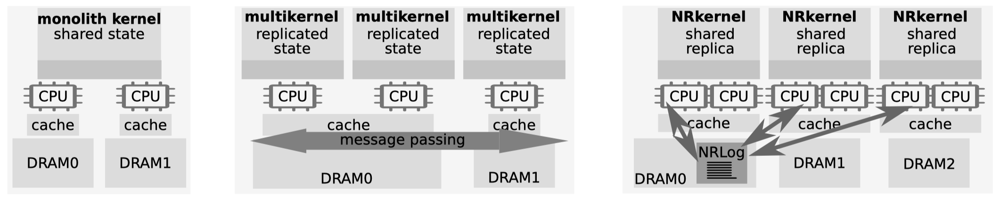

# NrOS: Effective Replication and Sharing in an Operating System

Ankit Bhardwaj and Chinmay Kulkarni, University of Utah; Reto Achermann, University of British Columbia; Irina Calciu, VMware Research; Sanidhya Kashyap, EPFL; Ryan Stutsman, University of Utah; Amy Tai and Gerd Zellweger, VMware Research

OSDI'21

Presented by Yuchao Qian

---
layout: center
---

# Outline

- **Background & Overview**
- Node Replication
- NrOS
- Evaluation
- Conclusion

---

# Background

- Increasing CPU core count
- Non-uniform memory access (NUMA)
- Elaborate concurrent data structures
    - fine-grained locking
    - read-copy-update (RCU)
    - Good performance but increased complexity

<!--

-->

---

# Background

- Big kernel lock works for microkernel[^1]
    - does not target NUMA
- Multikernel: per-core kernels, communicating via message passing[^2]
    - scales well
    - too much complexity and overhead for hosts with shared mem

[^1]: For a Microkernel, a big lock is fine. APSys'15.
[^2]: The Multikernel: A New OS Architecture for Scalable Multicore Systems. SOSP'09.

---

# Overview

- NRkernel
    - node replication[^1]
    - kernel state replica per NUMA node
    - read local replica concurrently
    - mutate by shared operation log, serially

[^1]: Black-box Concurrent Data Structures for NUMA Architectures. ASPLOS'17.

---
layout: default-grid
---

# Overview

---

# Overview

- NrOS: an NRkernel
    - NR-vMem
    - NR-FS
    - NR-Scheduler

---
layout: center
---

# Outline

- Background & Overview
- **Node Replication**
- NrOS
- Evaluation
- Conclusion

---

# Node Replication

